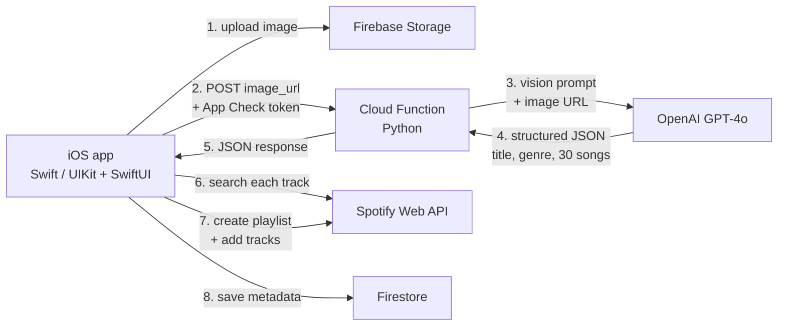

# Aurify

> Snap a photo. Get a 30-song Spotify playlist that matches its vibe.

Aurify is an iOS app that turns any image — a sunset, an outfit flat-lay, a cluttered desk — into a curated Spotify playlist. It uses GPT-4o Vision to read the *mood* of the image (colors, energy, aesthetic, references) and translates that into a Gen-Z-styled playlist title plus 30 tracks pulled live from Spotify.

<p align="center">
  
</p>

---

## Screenshots

> **Note:** these are placeholder frames pulled from the in-app onboarding animation. A proper screenshot tour and demo clip are next on the list.

<p align="center">
  
  
  
  
</p>

<!--
  TODO: replace with real screenshots in this order:
    1. Home / library view
    2. Upload + crop screen
    3. Loading / generating state
    4. Generated playlist with cover art
  And a demo clip (silent ~10s GIF or .mp4) at the top of this section
  showing: tap photo → playlist appears in Spotify.
-->

---

## What it does

1. User uploads (or takes) a photo and crops it.
2. The image is stored in Firebase Storage and a signed URL is sent to a Firebase Cloud Function.
3. The Cloud Function passes the image to **GPT-4o Vision** with a structured JSON prompt asking for: a playlist title (in a specific Gen-Z aesthetic — think *"clean girl. journaling. gym. 6 am. lexapro era."*), a primary and secondary genre from a fixed Spotify-compatible vocabulary, mood, target danceability/energy, and 30 song recommendations.
4. The iOS client takes that song list, resolves each track against the Spotify Search API, and uses the Spotify Web API to create a real playlist on the user's Spotify account.
5. Playlist metadata is saved to Firestore so the user's library survives across devices.

The result: a playable, persistent Spotify playlist generated end-to-end from a single image, in roughly 15-25 seconds.

---

## Architecture



The iOS client never talks to OpenAI directly — the API key lives only in the Cloud Function environment, and requests to the function are gated by **Firebase App Check** so only legitimate app installs can invoke it.

---

## Tech stack

**iOS (Swift, iOS 17+)**
- Hybrid **UIKit + SwiftUI** — older flows (playlist viewer, library, settings) are UIKit; newer flows (upload, sign-in, paywall, onboarding) are SwiftUI
- Spotify OAuth 2.0 with token refresh
- `TOCropViewController` for image cropping
- `SDWebImage` for async image loading and caching
- `RevenueCat` for subscription management + StoreKit configuration

**Backend (Firebase)**
- **Cloud Functions** (Python) — image-to-playlist endpoint, scheduled push notifications
- **Firestore** — user profiles, playlist library, daily-theme rotation
- **Storage** — uploaded images
- **Auth** — email/password and account management
- **App Check** — protects the Cloud Function from unauthorized callers
- **Cloud Messaging** — daily theme push notifications

**External APIs**
- **OpenAI GPT-4o Vision** — image analysis + creative title and song selection
- **Spotify Web API** — auth, search, playlist creation, playback control

---

## Project layout

```
Aurify/
├── VinylApp/                    iOS app source
│   ├── Controllers/
│   │   ├── Core/                tab bar, home, library
│   │   ├── Other/               playlist viewer, settings, paywall, auth
│   │   └── Welcome/             onboarding flow (SwiftUI)
│   ├── Managers/
│   │   ├── APICaller.swift      Spotify Web API client (~660 LOC)
│   │   ├── AuthManager.swift    Spotify OAuth + token refresh
│   │   ├── FirestoreManager.swift
│   │   ├── ImageManager.swift   resize/compress/upload pipeline
│   │   └── SubscriptionManager.swift
│   ├── Models/                  Codable models for Spotify + Firestore
│   ├── Views/                   reusable views (UIKit + SwiftUI)
│   └── Resources/               assets, fonts, colors, extensions
├── functions/
│   └── main.py                  Cloud Functions: GPT-4o vision call,
│                                daily push notifications, email alerts
├── Podfile                      CocoaPods dependencies
└── firebase.json                Firebase config
```

Total: ~6,300 lines of Swift across the iOS app, plus the Python Cloud Functions.

---

## A few details I'm proud of

- **Prompt engineering as a product feature.** The GPT-4o prompt in `functions/main.py` constrains output to a fixed JSON schema, restricts genres to Spotify's supported vocabulary so search resolves cleanly, and includes ~15 example titles to anchor the model in a specific cultural register. Without that anchoring, GPT happily produces titles like *"Summer Vibes Playlist"* — which is exactly the wrong aesthetic for the app.
- **Two-hop architecture protects the API key.** Every request from the app to the Cloud Function carries an App Check token tied to a real device + app install, so the OpenAI key never ships to clients and the function isn't trivially callable from outside the app.
- **Genre/subgenre mixing.** The model is asked for a primary *and* secondary genre, then picks an artist that bridges them. This produces playlists that feel curated rather than algorithmic — e.g. an indie-pop + bedroom-pop blend instead of "20 popular indie songs."
- **Resilient track resolution.** GPT-4o occasionally hallucinates songs that don't exist on Spotify. The iOS client gracefully skips unresolved tracks rather than failing the whole playlist, so a 30-song response that resolves 27 still produces a usable playlist.
- **Daily themes via push.** A scheduled Cloud Function rotates through a Firestore-backed pool of prompts (e.g. *"upload a photo of your morning"*), pushes them to subscribed users, and moves used themes to an archive collection so they don't repeat.

---

## What I'd do differently

This was an early project, so a frank retro:

- **Move Spotify client credentials server-side.** They currently live in `AuthManager.swift` — the right pattern is a token-exchange Cloud Function and a PKCE flow on device.
- **Decompose `APICaller.swift`.** It's a 660-line singleton; splitting it into per-resource clients (Profile, Playlists, Playback, Search) would make it far easier to test.
- **Finish the UIKit → SwiftUI migration.** The hybrid was pragmatic at the time but the seams between the two now cost more than they save.
- **Add unit tests around the playlist-resolution logic** — the part most likely to silently degrade as Spotify's search behavior changes.

---

## Running it locally

This isn't designed for one-click external setup (it's tied to my Spotify developer account, Firebase project, and RevenueCat configuration), but the moving pieces are:

```bash
# iOS
pod install
open VinylApp.xcworkspace

# Cloud Functions
cd functions
pip install -r requirements.txt
firebase deploy --only functions
```

You'd need: a Spotify developer app (client ID + redirect URI), a Firebase project with Auth/Firestore/Storage/App Check enabled, an OpenAI API key set on the Functions environment, and a RevenueCat account if you want the paywall to work.

---

## Status

Built solo as a portfolio project. The code reflects how I write iOS apps under realistic constraints — shipping over polishing — rather than as a textbook reference.
